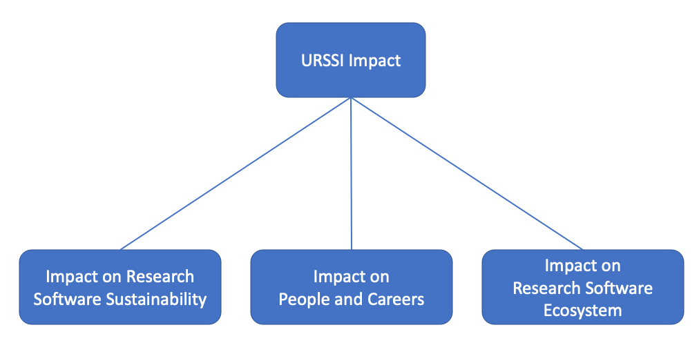

# URSSI Plan {#chapter3}

Throughout the URSSI conceptualization process, the team worked on overall
planning iteratively, using slides at workshops and the URSSI website to
disseminate current thoughts, using the survey and the ethnographic studies as
inputs, using workshops (including slides and shared note documents) and the
discussion forum (using Discourse on https://discuss.urssi.us) to gather and record feedback. Together,
these activities plus internal discussions of the team and a focused mission and
vision working group have led to most of the content of this document.

## Mission and Vision

URSSI PIs began to develop mission and vision statements in late 2018. The intent
of these statements was to succinctly state the purpose for URSSI’s existence
(mission) and based on that purpose what URSSI strives to achieve (vision). The
process for developing these statements was: 

* At the first two workshops, we asked participants about the goals and vision
that a US research software sustainability institute should pursue. 

* The URSSI PIs then identified institutions with similar goals and collected
their mission and vision statements for comparison. 

* Eight members of the Senior Personnel and Advisory Committee participated in
a working group focused on developing URSSI’s mission and vision statement. 

* Each working group participant provided a written set of three mission and
three vision statements based on the conceptualization proposal, workshop
participant’s feedback, and guidance from the URSSI PIs. 

* Neil Chue Hong, director of the Software Sustainability Institute in the UK,
facilitated a synthesis of the working group’s feedback. This synthesis process included a
teleconference with participants to discuss and refine versions of each
mission and vision statement. 

* The URSSI PIs then presented drafts of each statement to workshop participants
at the final URSSI meeting in Chicago and refined a final version of each statement.

The mission and vision of URSSI are as follows:  
 
**Mission**: Our mission is to improve the recognition, development, and use of
software for a more sustainable research enterprise. We achieve this mission
through collaboratively developing education, outreach, and software services
that emphasize open, transparent reproducible, and cooperative practices. URSSI
is an institute for software expertise as well as a social infrastructure that
promotes an inclusive and diverse community of research software engineers,
maintainers, contributors, and users.
 
**Vision**: Empowered people, building better software, enabling exceptional research
 

## Planning assumptions, methods, and principles

The following assumptions are inputs to our planning process: 

* Our plan is based on the idea of proposing to NSF, and therefore, focuses on the
US community. We will, however, work with like-minded organization both inside and
outside the US, including the [Research Software Alliance (ReSA)](https://www.researchsoft.org).
(Also see the potential partners listed the next subsection.)

* We will propose an institute with a 5-year duration and a potential 5-year
extension, based on NSF’s current institutes and published documents.

* The budget of URSSI will be $3m-$5m per year. We take $3m as the baseline
minimum funding level needed to operate an institute, below which an institute
is not the right method to achieve the mission and vision, and then build higher
cost and higher return activities on that baseline.

* There is demonstrated interest in supporting some URSSI goals from private
foundations and potential interest from other federal agencies, so URSSI
activities should be planned as a set of reinforcing (but separable) activities,
potentially on different timelines.

* There is a strong need for improved software sustainability across all fields,
and URSSI cannot solve this need in all fields by itself.

* There are many partners who can help URSSI achieve some of its goals, as there
is overlap between these goals and the goals of those partners (see the next subsection)

* It is not practical for URSSI to directly work with the US research software development
community (all of those who develop research software in the US, including in academia,
national laboratories, and industry) due to the small size of URSSI and the very large size of this community, so
URSSI needs to work indirectly by leveraging other groups.

Given the mission and vision, and our assumptions, we plan to use a set of methods
to ensure that URSSI is successful:
 
* URSSI must choose a set of initial targeted communities and efforts, focus on
them for some period (until some predefined metrics of success are met or some predefined
time period has passed without success), then move on to the next set of targets

* URSSI must work closely with partners to amplify its efforts (see the next subsection)

* URSSI must be clever about using resources, attempting to achieve multiple outputs
for activities whenever possible.
 
Guiding principles:

* Leverage existing organizations for authority, credibility, resources

* Focus on people, not projects

* Leverage available resources (software, services, credit systems, training
materials, etc.) where possible rather than reinvent

* Share resources we create to allow others to reuse and build on elsewhere

* Respect and learn from volunteers

* Activities should have an end or a sustainability plan beyond URSSI

* Distinguish between quality (badging/intrinsic) and impact (reuse) measures

* Sustain software by sustaining its communities (stewards, developers, maintainers,
leaders, active users)

* Coordinate activities rather than start new ones when possible

* Advocate and promote a variety of solutions to challenges, recognizing that no one
solution is likely to work for all stakeholders or in all situations

Some topics are partially or completely out-of-scope for URSSI:

* **Software Commercialization**. As an institute, URSSI will position
itself as a broker to existing bodies of knowledge or expertise, and
seek to fill needed gaps where no expertise already exists. Relevant
to this positioning is a route to research software sustainability through
software commercialization. We view this path to sustainability
as already well supported by existing programs and initiatives, some of
which are already funded by NSF. As a principle, URSSI is not opposed
to or discouraging of research software commercialization. We will actively
seek to learn from and collaborate with the commercial software ecosystem,
including technology transfer offices that provide structured pathways to
commercialization for research software in academic institutions. In this
role, URSSI might guide people in deciding if commercialization is a
realistic or good choice for their software project, and connect those who
decide that it is to existing support programs like
[I-Corps](https://www.nsf.gov/news/special_reports/i-corps/). What we believe
URSSI can uniquely provide, and what we find to be lacking, is support for
alternative routes to sustainability through open-source or non-commercial
fiscal sponsorship. While these alternative routes are obviously less
straightforward, and more challenging they remain the most viable option for
improving the long-term accessibility and impact of most research
investments in software. A majority of even the best research software projects
won't be commercially viable given the size and scope of their audience. It is
this critical gap, between commercialization and open-source, that URSSI seeks
to close. 

* **Software Development and Maintenance**. URSSI staff will not develop or
maintain research software, nor will URSSI provide funds to projects to do this,
other than as part of focused incubation or training activity. Given the small size
of URSSI and the large size of the software development and maintenance community,
such hands-on software work is not a useful way for URSSI to have an impact.

* **Infrastructure**. URSSI will not run infrastructure for the research software
community.  If new infrastructure is needed, URSSI will work with other organizations
to instigate projects to create and maintain that infrastructure, run by those other
organizations.

to create and maintain that infrastructure, run 
[**TODO**: what else should be out-of-scope for URSSI?]

## Partners

URSSI will work with a variety of partners with whom we have overlapping goals.
For the purpose of this plan, we list partners with whom we will seek to work, recognizing that
these potential partner organizations have not made a commitment, and such commitments will
depend on specific activities, and specific funding opportunities. In the following table, we list
these potential partners and the areas in which we see an opportunity for collaboration. See the
appropriate chapters (e.g. [Community & outreach (Chapter 4)](Ch-Comm), [Education & training (Chapter 5)](Ch-Edu), etc.)
for the specific partnering opportunities in each area of URSSI's work.

| Potential partner | Partnering area(s) |
| --- | --- |
| Other NSF SI2/CSSI Institutes & Centers of Excellence (e.g., [SGCI](https://sciencegateways.org), [MolSSI](https://molssi.org), [IRIS-HEP](https://iris-hep.org)) | policy, education & training, incubator, community & outreach |
| [Research Software Alliance (ReSA)](https://www.researchsoft.org) | policy, community & outreach |
| [Software Sustainability Institute (SSI)](https://software.ac.uk) | policy, education & training, incubator, community & outreach |
| [Better Scientific Software (BSSw)](https://bssw.io) | policy, education & training, community & outreach |
| Fiscal sponsors (e.g., [NumFOCUS](https://numfocus.org), [Code for Science & Society](https://codeforscience.org)) | policy, incubator, community & outreach |
| [US-RSE Association](https://us-rse.org) | policy, education & training, community & outreach |
| (UK) [RSE Society](https://society-rse.org) | policy, education & training, community & outreach |
| [Academic Data Science Alliance (ASDA)](https://www.academicdatascience.org) | policy, community & outreach |
| [Research Data Alliance (RDA)](https://www.rd-alliance.org) | policy, education & training |
| [American Association for the Advancement of Science (AAAS) Science & Technology Policy Fellows](https://www.aaas.org/programs/science-technology-policy-fellowships) | policy, community & outreach |
| [Campus Research Computing Consortium (CaRCC)](https://carcc.org) | policy |
| [Organisation for Economic Co-operation and Development (OECD)](http://www.oecd.org) | policy |
| [The Carpenties](https://carpentries.org) | education & training |

## Desired impact

URSSI's ultimate desired impact, as stated in the vision, is on scholarly
research in all fields.  URSSI aims to achieve
this impact by enabling and encouraging the contribution of the resources and training to the research software
ecosystem that will improve research software and to empower the people who
create and maintain that software.
 

For software, URSSI aims to improve the sustainability of research software by

* Developing and sharing good-enough and best practices for software projects,
including for testing, governance, codes of conduct, continuous integration

* Documenting sustainability models and providing guidance on how to choose among them

* Promoting communities and appropriate governance models for open source research software

* Building models to make best use of and support transient software contributors (e.g. students)
 
For people, URSSI aims to improve the careers of those who develop and maintain
research software by:

* Promoting new career paths for those who develop and maintain research software

* Developing and advocating for research software usage and impact metrics to be
a factor in the hiring and promotion of software developers and maintainers 

* Promoting the publication of research software

* Coordinating community efforts, including by URSSI, to create and provide training
for those who want to develop and maintain research software

* Encouraging a diverse set of participants to enter the research software
development and maintenance field and decreasing structural and systemic
barriers to productive careers for members of underrepresented groups
 
For the research software ecosystem, URSSI aims to improve the understanding and functioning of the ecosystem by

* Documenting the use of research software in research and providing
systematic and regular analysis of the impact this software has on research 

* Growing and participating in communities around the field of research software

* Promoting an increased understanding of the importance of research software in research

* Promoting software credit and citation mechanisms

* Studying and disseminating methods to catalog and promote research software

* Supporting the use of software in reproducibility

