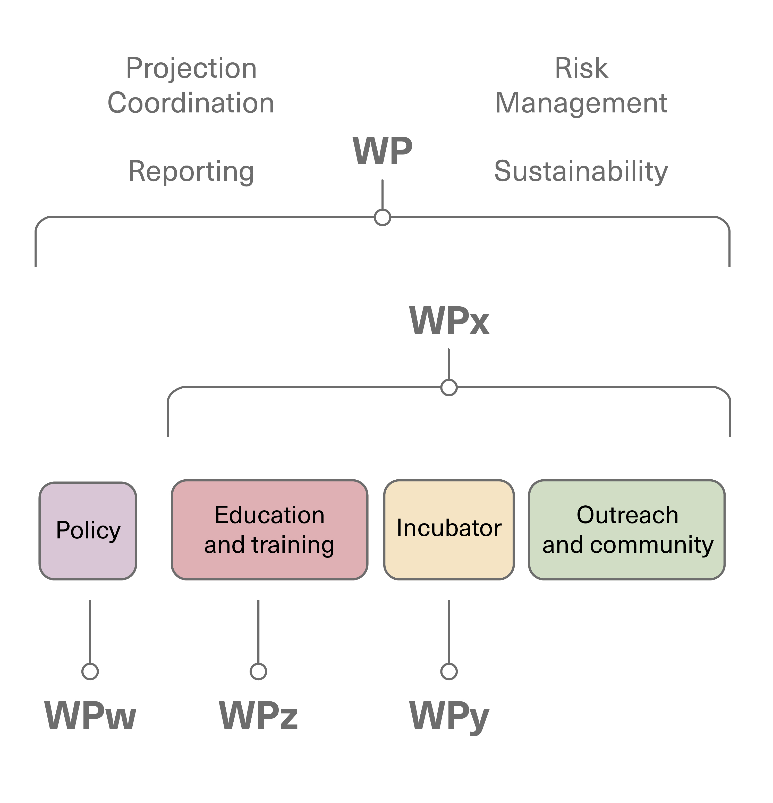

# Management & Coordination Area {#Ch-Org}
The Management & Coordination Area of URSSI is designed to manage the project (assign and monitor work,
usually in work packages; monitor, mitigate, and respond to risks; provide reports; adapt work to
community feedback; and ensure project sustainability) and foster collaboration between the four
other areas of URSSI: Policy, Education & Training, Incubator, and Outreach & Community. 

## Work packages
All work to be done in URSSI (including management and coordination) is structured into
work packages (WPs), which are organized around the project’s goals and areas, with an additional
WP that is concerned with quality and risk management, project coordination, sustainability, and
reporting activities. A WP defines a discrete unit of work over some period, and can be part of
one or more areas. The duration of a WP can be a fixed period (e.g., six months to organize and
run a single training event) or can span the full lifetime of the project, such would be the case
for the maintenance of the website or regular distribution of newsletters. For example, a WP to
support a new open-source project might last a year and span three areas: education & training,
incubator, and outreach & community. 

Fig. Areas and WPs: A WP can exist in one or more areas. The WP “Project coordination, risk management
and reporting” spans all four areas and lasts for the duration of the project. WPx, for example, is
part of Education & Training, Incubator, and Outreach & Community. WPy, WPz, and WPw each exist in
a single area.

## Management structure and procedures 
Management of URSSI includes activities that occur at different levels, appropriate to the size and
structure of the institute. This section presents the project's organizational and decision-making
mechanisms, as well as its process for ensuring effective information interchange between the
individual work packages. Central to the project's management is a key set of roles and committees,
which are described in detail below: the PI, the Co-PIs, the Work Package Leaders, a sustainability
officer, an evaluator, and the Steering Committee. Work Package leaders may be Co-PIs or other URSSI staff.

The **PI and Co-PIs** have overall responsibility for project activities and will work with the
evaluator to make periodic revisions to ensure the project's continuing success.The PI will manage
the administrative and financial aspects of the project, with the assistance of one or two staff
members. The PI will also oversee the day-to-day management of the project, with the support of the
Co-PIs. The PI and Co-PIs are responsible for reviewing the overall progress of the project. They will
work closely with the Work Package Leaders to manage the technical work of the project.
**Work Package Leaders** will be responsible for the progress of their individual work packages, the
timely production and quality of deliverables, and the achievement of milestones.
The **Sustainability Officer** will work towards ensuring the sustainability of the overall institute.
The **Steering Committee** will advise and support the PI and Co-PIs. **Senior Personnel** are
responsible for tasks assigned to them by Work Package leaders. Tasks include administrative tasks for the project.

This structure has been developed to:

- Ensure effective management of the project;

- Ensure clearly defined communication channels both internal and external to the project;

- Establish clear procedures for making decisions and resolving conflicts;

- Ensure the project proceeds within the framework of the budget and according to administrative, financial,
and legal principles defined by NSF; and

- Ensure that the participants meet their obligations in the project.

## Project Management Team
The project management team comprises

- Leadership Team (the PI and Co-PIs)

- Work Package Leaders

- Sustainability Officer

- Evaluator

- Senior Personnel

In addition to this team, the project will rely on a Steering Committee.

The Project Management Team will meet on an annual basis, starting with an initial meeting in the
first month of the project to promote effective and efficient work among all participants. This
meeting will include the whole project management team along with invited experts. The PI can call
additional meetings at any time. The annual meetings will be face-to-face when possible. Additional
meetings may be via telephone conference, video conference, or both. In addition to the core project
team, the PI can invite any person knowledgeable about an area of concern within the URSSI scope to
attend Project Management Team meetings in an advisory capacity.

The Project Management Team will contribute to the strategic orientation of the project and represents
the interests of all participants. Its main tasks are to:

- Collect feedback from potential user researcher communities and developer communities;

- Disseminate the project’s latest results via publications and presentations at conferences and workshops; and

- Accomplish the work packages.

### Steering Committee
The Steering Committee will be formed at the start of the project. It will consist of 6-8 experts invited
by the Leadership Team, drawn from diverse areas including sustainability, software engineering, and
domain researchers. Steering Committee members will be asked to serve for two-year terms, though initial
terms may be longer or shorter to set up staggered terms for the committee. Members can continue for
additional terms if both the member and the project (PI and Co-PIs) agree. 

The Steering Committee will be the ultimate advisory group in the running of the project. Its role is to 

- Give guidance to the PI, Co-PIs and Work Package Leaders;

- Exchange experiences and formulate ideas for interoperation with other SI2/CSSI projects
(e.g. MolSSI, IRIS-HEP) and on sustainability;

- Advise in scientific decisions.

The Steering Committee will be invited to every Project Management Team meeting.

### PI
The PI will coordinate the project and will:

- Address all recommendations submitted by the Steering Committee and the Project Management Team, taking appropriate actions;

- Address ethical, legal and diversity issues relevant to the project;

- Approve project budgets;

- Ensure the project proceeds according to administrative, financial, and legal principles defined by NSF;

- Participate in annual NSF PI meetings; and

- Report to NSF.

### Leadership Team (PI and Co-PIs)
The PI and Co-PIs form the Leadership Team: the decision-making body of the project. They will:

- Set the strategic direction of the project;

- Ensure effective operation of the project and ensure that all efforts are focused towards achieving its objectives;

- Define work packages and the assign work package leaders;

- Invite Steering Committee members;

- Address risks that may impair progress towards the project’s objectives and propose strategies to address those risks;

- Direct the project according to the work plan taking corrective actions as needed;

- Ensure the free flow of information between Work Package Leaders and ensure cooperation and liaison between
the individual work packages takes place;

- Ensure that the work packages interact effectively;

- Ensure deliverables are of good quality and on time;

- Assemble progress reports and deliverables;

- Monitor the progress of work packages towards their milestones and deliverables.

### Work Package Leaders
A work package leader is responsible for the effective planning, execution, and reporting for an individual work package.
They will be responsible for:

- Coordinating the communication and work between partners within their work package;

- Understanding work package constraints and coordination issues, especially if a work package falls into several areas;

- Ensuring progress towards work package milestones and deliverables;

- Ensuring  all work package reports and deliverables are produced in a timely fashion;

- Ensuring all results and outputs are disseminated effectively to other work packages;

- Ensuring good communication with other work packages;

- Reporting the progress of their work package to the PI and Co-PIs;

- Providing support for the PI;

- Setting up regular meetings (about weekly or bi-weekly) between participants within their work package
via telephone conference, video conference or both.

### Sustainability Officer
The sustainability officer ensures that all actions and work packages are analyzed regarding their
contribution to the sustainability of the institute. Work packages might be effective at the beginning
of the institute but might phase out over time or need to be redefined with different metrics, for
example. The sustainability officer can suggest and lead work packages such as building additional
collaborations and analysing and/or applying for additional funding streams. They would collaborate
closely with the incubator area to use its methods for spinning out work packages to be self-sustainable
beyond the duration and funding of the project. 

### Evaluator
The evaluator is responsible for assessing the performance of the project, including by defining appropriate
metrics, and suggesting appropriate measures if performance is found to be lacking or goals of the project
are not met.

## Risk management

The leadership team as well as the steering committee are well experienced in project and risk management.
The leadership team will maintain a risk register that is refreshed at least annually, and will address
risks that may impair progress towards the project’s objectives by proposing strategies to address those
risks and directing the project according to the work plan, taking corrective actions as needed. The
project plan will be designed to accommodate appropriate and proven risk management practices.

Some risks common to any type of project of this size and complexity, including coordination risks,
problems in tasks delivering, loss of a project team member and a low impact on community building and
community growth. Other risks are specific to this institute plan, such as little interaction between
existing institutes for complementing each other’s activities.

| Risk | Likelihood | Impact | Rating | Mitigation                                                                                                                                                                                                                                                                                                                                                                                                                                                                      |
|---------------------------------------------------------------------------------------------------------------------------------------------------------------------------------------------------------------|------------|--------|--------|---------------------------------------------------------------------------------------------------------------------------------------------------------------------------------------------------------------------------------------------------------------------------------------------------------------------------------------------------------------------------------------------------------------------------------------------------------------------------------|
| Coordination risks                                                                                                                                                                                            |            |        |        |                                                                                                                                                                                                                                                                                                                                                                                                                                                                                 |
| The coordination of many project team members can be difficult and problems in communication and organization can upset the project.                                                                          | 2          | 2      | 4      | Prevention: Clear communication channels Regular meetings Measures in the case of occurrence: Improve communications among team members with scheduling more meetings and adding communication channels                                                                                                                                                                                                                                                                         |
| Problems in task delivering                                                                                                                                                                                   |            |        |        |                                                                                                                                                                                                                                                                                                                                                                                                                                                                                 |
| A task will be not or late delivered  due to several problems: financial, organizational or technical.                                                                                                        | 1          | 2      | 2      | Prevention: The implementation and execution risk is minimised by the detailed work package descriptions and resources allocation, by the complementary expertise and roles in the work packages The project plant will continuously assess project risks based on input from the project team. Measures in the case of occurrence: Appropriate corrective actions will be decided as necessary, and tracked to completion to avoid or reduce the effect of any risk detected.  |
| Loss of project team member                                                                                                                                                                                   |            |        |        |                                                                                                                                                                                                                                                                                                                                                                                                                                                                                 |
| Parts of the intended results cannot be delivered and the expertise of the team member is missing. That could delay or - dependent on the team member and on the point of time - endanger the whole project.  | 2          | 3      | 6      | Prevention: Mitigate by having overlapping expertise between team members.Code of conduct to avoid conflicts between team members. Measures in the case of occurrence: Providing clear communication channels if conflicts occur. Redefining of goals and responsibilities and acquiring staffing if a team member leaves.                                                                                                                                                      |
| Low impact on community building and community growth                                                                                                                                                         |            |        |        |                                                                                                                                                                                                                                                                                                                                                                                                                                                                                 |
| Activities may have less impact as expected                                                                                                                                                                   | 1          | 3      | 3      | Prevention: Evaluation of work packages and tasks and collecting feedback from the community on different activities  Measures in the case of occurrence: Adapting of the work plan and further outreach activities                                                                                                                                                                                                                                                             |

