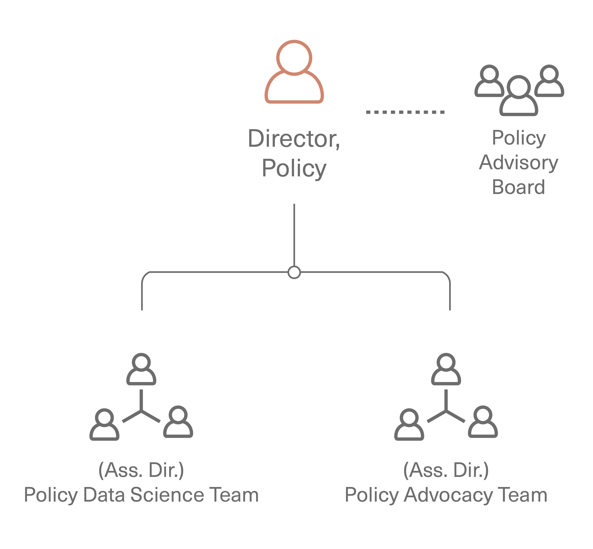

# Policy

The Policy area’s intent is to support the people who develop and maintain research software, and to
support research about research software, to ultimately increase the science & research impact of
software.  It does this by focusing on potential initiatives (actions, mandates, incentives, directives)
decision makers can take to have a broad influence on the area, sometimes thought of as leverage points,
including strategies and decisions to invest. Policy happens at multiple levels, including  national,
funding agency, institution, and research group.

The Policy area's activities are divided into two parts, research and advocacy.  Research is the collecting
and analyzing of data, while advocacy is the dissemination of the research results in such a way that it
changes practices.

## Subgoals

The changes that the policy area seeks to make include:

1. In funding agencies, direct funding of software maintenance other software sustainability activities
is a core part of the mission, e.g., at NSF, this includes all program officers across all directorates

2. In universities and academic fields, positions for people developing and maintaining research software
are available, recognized, and rewarded

3. In publishing, support and recognition for software as a core part of science is the norm

4. In industry, sharing best practices, coordinating efforts, and contributing to open source software
projects is the norm

5. Open source software is recognized as a key element of open science and reproducibility

6. Diversity of software project contributors is Increased

## Area Structure

The policy area comprises:

* Director for Policy, an URSSI co-PI, leads the overall Policy area, working with the
Policy Advisory Board and Policy staff to define and execute policy research and advocacy activities.

* Policy Data Science Team: performs research aimed at informing policy, but not about policy
itself, for example, with regard to software usage metrics, empirical studies would be most effective.
Includes funded staff, URSSI fellows, and community volunteers.

* Assistant Director for Policy Advocacy, focuses more on planning advocacy that in doing it,
by understanding different stakeholders, and building a roadmap for how to effectively advocate
(within universities, foundations, industry, national labs, etc.)

* Policy Advocacy Team, focused on policy development (such as use cases and examples of practices
that are effective for sustainability), which ultimately would be used for presenting turnkey ways
to support research software to institutions, possibly integrating and building upon the data science
team’s findings. Includes funded staff, URSSI fellows, and community volunteers.

* Policy advisory board (appointed volunteers) who provide advice on potential policy area and activities

## Resources

The policy area will require resources that include funding for salaries, for events, and for travel.

**Funding for personnel** (e.g., buying out parts of contracts):

* 3 FTEs, divided across Assistant Director for Policy Advocacy, Policy Data Science Team
(potentially a postdoc), Policy Advocacy Team

Additional team members, not funded by the policy area:

* Director for Policy, an URSSI co-PI, funded by URSSI at top level
* Policy Advisory Group (appointed volunteers)
* URSSI fellows, working in Policy Data Science Team and Policy Advocacy Team
  * (**TODO**: Fellows program to be run by URSSI Community area; these policy fellows might
  be funded by policy area if needed)
* Other community volunteers, in Policy Data Science Team and Policy Advocacy Team

**Funding for workshops**: **TODO**: TBD
 
* Potentially including a policy conference / workshop(s) akin to Aspen Institute / CODATA - $370k,
also could be part of an annual URSSI event
 
**Funding for travel/speaking**: **TODO**: TBDTBD
 
If there is less budget available, we would cut back on workshop funding 
 
If there is less budget available, we would:

* Expand policy program to have a summer program for undergraduate and graduate students focused
on software / science policy (e.g., an REU or something like a google summer of code for policy / law students)

* Hire communication staff to do outreach and engagement around policy topics (would be dedicated
expertise in policy as opposed to general outreach)

## Methods and processes

Initial activities are planned with respect to the set of challenges that follows, but other
challenges can also be introduced.  The URSSI leadership group will regularly review suggestions
of new challenges, and will determine a rough desired level of activity across the challenges.

The policy team will then develop and scope activities to match these desired levels, with review
from the Policy Advisory Board, which will also be able to suggest adding or removing challenges
back to the leadership group.

The policy team will also maintain this listing of active, planned, and potential activities and
its mapping to the challenges. Activities will be split into those that, if successful, are likely
to lead to significant changes in 1-2 years, 3-5 years, and longer-term, with an initial goal of
applying 50% of resources to the 1-2 year activities, 40% to the 3-5 year activities, and 10% to
the longer-term activities.

### Challenges

Initially, the policy area has the following set of challenges to address:

1. Career paths (including titles and evaluation criteria for hiring and promotion) aren’t well
established.

2. It’s hard to measure the impact of individuals, especially in activities that are inherently
collaborative like software development. 

3. The academic credit model disincentivizes individual contributions to public goods / infrastructure

4. We conflate quality and impact of software and need to disentangle them.

5. There is a lack of recognition of the value and importance of software.

6. There is a lack of funding opportunities and stable funding for maintenance of software that
is important but doesn’t have a generic market, and “lumpy” project funding (projects that are
competitively funded for fixed periods, often with gaps between funded project periods) means
that maintenance/sustainability can’t be reliably folded into project costs.

7. The development and maintenance community is much less diverse than the overall US population.

### Partners

The Policy area will work with other NSF SI2/CSSI Institutes & Centers of Excellence
(e.g. [SGCI](https://sciencegateways.org), [MolSSI](https://molssi.org), [IRIS-HEP](https://iris-hep.org)),
the [Research Software Alliance](https://www.researchsoft.org),
the [Software Sustainability Institute](https://software.ac.uk),
the [US-RSE Association](https://us-rse.org),
the (UK) [RSE Society](https://society-rse.org),
The [Academic Data Science Alliance](https://www.academicdatascience.org),
[CaRCC](https://carcc.org),
and any other projects and organizations that also seek to address overlapping challenges.
 
The Policy area needs to build relationships with the following groups and organizations, and
to work closely with them, particularly in policy activities.

* Institutional and research leaders in the academic and national laboratory community, such as
VCRs, CTOs/CIOs, who can help URSSI penetrate various institutions and disciplines

* Representatives from professional academic associations

* Representatives from industry (including those already invested and sold on OSS, as well as
those skeptically interested)

* Representatives from Open Source communities, particularly those that are already effective and working at scale

* People working in science policy, such as in AAAS and the National Academies

* Representatives from organizations and companies serving OSS and RSE communities
(e.g. [NumFOCUS](https://numfocus.org), [Code for Science & Society](https://codeforscience.org), GitHub, Code Ocean)

* Representatives from organizations that represent other research support roles
(e.g., librarians, data stewards, RSEs), to work together to promote all such roles

* Representatives from organizations that focus on diversity and inclusion in academia,
to encourage them to include software-focused roles where possible

* People from the European Commission regarding European Open Science Cloud (EOSC), etc.

* Representatives from organizations like the Research Data Alliance and FORCE11

### Planned Activity Pool

... in progress ...

