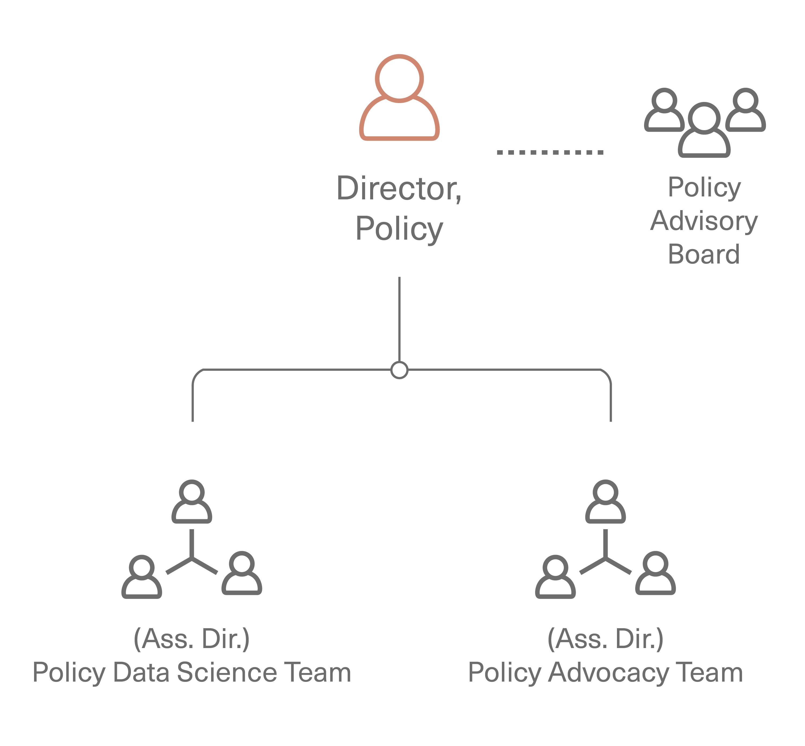

# Policy {#Ch-Policy}

The Policy area’s intent is create an enablng environment to support the people who develop and maintain research software, and to
support research about research software, to ultimately increase the science & research impact of
software.  
**The Policy area's activities are divided into two parts, research and advocacy**.  Research is the collecting
and analyzing of data, while advocacy is the dissemination of the research results in such a way that it
changes practices.
The Policy area focuses on understanding and then advocating for potential initiatives (actions, mandates, incentives, directives)
that decision makers can take, sometimes thought of as leverage points,
including strategies and decisions to invest. Policy happens at multiple levels, including  national,
funding agency, institution, and research group.

The Changes that the Policy area seeks to make include:

1. In funding agencies, direct funding of software maintenance and other software sustainability activities
is a core part of the mission, e.g., at NSF, this includes all program officers across all directorates.

2. In universities and academic fields, positions for people developing and maintaining research software
are available, recognized, and rewarded.

3. In publishing, support and recognition for software as a core part of scholarly research is the norm.
(This includes the recognition that software is as valuable to the research community as the results themselves,
that processes exist to evaluate software in papers, expectations for authorship for software developers are clear.) 

4. In industry, sharing best practices, coordinating efforts, and contributing to open source software
projects is the norm.

5. Open source software is recognized as a key element of open science and reproducibility.

6. Research software is built and maintained by a diverse and inclusive group.

## Policy resources

The policy area will require resources that include funding for people and for events and travel.

### People

The policy area comprises:

* Director for Policy, an URSSI co-PI, leads the overall Policy area, working with the
Policy Advisory Board and Policy staff to define and execute policy research and advocacy activities.

* Policy Data Science Team: performs research such as finding, collecting, and analyzing data,
aimed at informing policy, but not about policy
itself. For example, with regard to software usage metrics, empirical studies would be most effective,
but this team would not recommend policy language based on those studies.
Includes a possible assistant director, funded staff, URSSI fellows, and community volunteers.

* Policy Advocacy Team, focused on policy development (such as use cases and examples of practices
that are effective for sustainability), which ultimately would be used for presenting actionable ways
to support research software to institutions, possibly integrating and building upon the data science
team’s findings. This team focuses more on planning advocacy that in doing it,
by understanding different stakeholders, and building a roadmap for how to effectively advocate
(within universities, foundations, industry, national labs, etc.)
Includes a possible assistant director, funded staff, URSSI fellows, and community volunteers.

* Policy advisory board (appointed volunteers) who provide advice on potential policy area
research questions and advocacy activities.

**Funding for personnel**:

* 3 FTEs, divided across possibly part-time Assistant Directors for Policy Data Science and Policy Advocacy,
the Policy Data Science Team (potentially a postdoc), and the Policy Advocacy Team.
The Director for Policy might also act as one of the Assistant Directors, depending on that person's background.

Additional team members, not funded by the policy area:

* Director for Policy, an URSSI co-PI, funded by URSSI at top level
* Policy Advisory Group (appointed volunteers)
* URSSI fellows, working in Policy Data Science Team and Policy Advocacy Team
  * (Fellows program to be run by URSSI [Community](#Ch-Comm) area; these policy fellows might
  be funded by policy area if needed)
* Other community volunteers, in Policy Data Science Team and Policy Advocacy Team

### Additional resources

Additional resources may be needed by the research group for data collection, management, analysis, etc.,
and by the advocacy team for dissemination of materials and community organization and support.
Both teams may need additional resources for producing materials, including graphic design, copy editing, etc).
Amount are **TODO** TBD

### Events & travel

**Funding for workshops**: **TODO**: TBD
 
* Potentially including a policy conference / workshop(s) akin to Aspen Institute or CODATA - $370k.
This could also could be part of an annual URSSI event. Some events might also be low/no cost, held fully virtually.
 
**Funding for travel/speaking**: **TODO**: TBD

* As part of advocacy activities, URSSI personnel will discuss findings and recommendations.
 
### Flexibility

If there is less budget available, we would cut back on workshop funding 
 
If there is more budget available, we would:

* Expand policy program to have a summer program for undergraduate and graduate students focused
on software / science policy (e.g., an [NSF REU site](https://www.nsf.gov/crssprgm/reu/faculty.jsp) or something like a Google Summer of Code for policy / law students)

* Hire communication staff to do outreach and engagement around policy topics (dedicated
expertise in policy as opposed to general outreach)

## Policy methods

Initial activities are planned around an initial set of aims articulated below, where additional
aims also will be suggested.  The URSSI leadership group will regularly review suggestions
of new aims, and will determine a rough desired level of activity across the aims.

The policy team will then develop and scope activities to match these desired levels, with review
from the Policy Advisory Board, which will also be able to suggest adding or removing aims
back to the leadership group.

The policy team will also maintain this listing of active, planned, and potential activities and
its mapping to the aim. Activities will be split into those that, if successful, are likely
to lead to significant changes in 1-2 years, 3-5 years, and longer-term, with an initial goal of
applying 50% of resources to the 1-2 year activities, 40% to the 3-5 year activities, and 10% to
the longer-term activities.

### Aims

Initially, the policy area will work to address the following set of aims:

1. Establish career paths (including titles and evaluation criteria for hiring and promotion).

  - addresses Changes 2, 5 (from list of changes at the start of this chapter)

2. Improve the measurement of impact of individuals, especially in activities that are inherently
collaborative like software development. 

  - addresses Changes 1, 2, 3

3. Incentivizes contributions to public goods / infrastructure within the academic credit model 

  - addresses Changes 1, 3, 5

4. Disentangle software quality and software impact.

  - addresses Changes 1, 4, 5

5. Better recognize the value and importance of software.

  - addresses Changes 1, 2, 3, 5

6. Improve/increase funding opportunities and stable funding for maintenance of software that
is important but doesn’t have a generic market and/or isn't considered novel in the eyes of the
average funder/reviewer. Today “lumpy” project funding (projects that are
competitively funded for fixed periods, often with gaps between funded project periods) means
that maintenance/sustainability can’t be reliably folded into project costs.

  - addresses Changes 1, 4, 5

7. Increase the diversity of the development and maintenance community to achieve the diversity of the overall US population.

  - addresses Change 6

### Partners

The Policy area will seek to work with partners listed in the "Partners" section of [Chapter 3](#chapter3), specifically including:

other NSF SI2/CSSI Institutes & Centers of Excellence
(e.g. [SGCI](https://sciencegateways.org), [MolSSI](https://molssi.org), [IRIS-HEP](https://iris-hep.org)),
the [Research Software Alliance](https://www.researchsoft.org),
the [Software Sustainability Institute](https://software.ac.uk),
the [US-RSE Association](https://us-rse.org),
the (UK) [RSE Society](https://society-rse.org),
the [Academic Data Science Alliance](https://www.academicdatascience.org),
the [Research Data Alliance](https://www.rd-alliance.org),
the [American Association for the Advancement of Science (AAAS) Science & Technology Policy Fellows](https://www.aaas.org/programs/science-technology-policy-fellowships),
[CaRCC](https://carcc.org),
[OECD](http://www.oecd.org),
and any other projects and organizations that also seek to define and address overlapping aims.
 
The Policy area needs to build relationships with the following groups and organizations, and
to work closely with them, particularly in policy activities.

* Institutional and research leaders in the academic and national laboratory community, such as
VCRs, CTOs/CIOs, who can help URSSI penetrate various institutions and disciplines

* Representatives from professional academic associations

* Representatives from industry (including those already invested and sold on OSS, as well as
those skeptically interested)

* Representatives from Open Source communities, particularly those that are already effective and working at scale

* People working in science policy, such as in AAAS and the National Academies (in particular, AAAS policy fellows might be interested in helping on time-constrained activities that match the purpose and period of their fellowship)

* Representatives from organizations and companies serving OSS and RSE communities
(e.g. [NumFOCUS](https://numfocus.org), [Code for Science & Society](https://codeforscience.org), GitHub, Code Ocean)

* Representatives from organizations that represent other research support roles
(e.g., librarians, data stewards, RSEs), to work together to promote all such roles

* Representatives from organizations that focus on diversity and inclusion in academia,
to encourage them to include software-focused roles where possible

* People from the European Commission regarding European Open Science Cloud (EOSC), etc.

* Representatives from organizations like the Research Data Alliance and FORCE11

### Planned Activity Pool

This is the initial list of activities that URSSI will maintain, and choose from. The specific
activities that will be chosen to start depend on the funding level for URSSI. Most activities
include an amount of effort (generally in person-months) that is needed to accomplish them.
Note that some activities (the items below) include
raising additional funds for those activities - that fund raising is part of the activity. Other
activities (in the "Unplanned Activity Pool" subsection) are tracked but are beyond the scope of URSSI, and are more
likely activities that others might perform, potentially in coordination with URSSI.

Activities are divided into two types:

1. **Policy Research Activities**. These activities involve research, such as gathering and analyzing evidence and data.

2. **Policy Advocacy Activities**. These activities focus on advocacy. They generally depend on policy research or previously
gathered evidence and data.

High-level activities include:

* Maintaining the list of potential activities and prioritizing them, including getting inputs
from the overall community. These inputs will be collected and recorded by all members of the
project in their interactions with the community, as well as by community members, via tagged
GitHub issues. Community members will be able to see this list and react with a +1 to issues
they think are important, and URSSI will use these reactions as an element of prioritization. (ongoing)

* Tracking completed activities and their consequences (ongoing)

* Collecting examples of good and bad policy, structures, and interventions from industry and
from other disciplines (potential fellow project)

* Developing an advocacy roadmap for how to effectively advocate (to universities, foundations,
industry, national labs) (policy person & advisory committee, spread over 3 months)

Additionally, while this is a plan and not a proposal (it doesn't have a budget envelope it is working to fit in,
it is not responding to a specific solicitation, and the potential funder's goals are unclear) we have
considered priorities for these activities. Initial activities will mostly focus on research, as most advocacy
activities would follow and be based on the results and lessons of the research activities. In addition,
as mentioned above, final prioritization will also need inputs from the Policy Advisory Board and the URSSI
leadership team. Activities with a preceding "(+)" are considered higher priority than other activities.

#### Career Path Activities (Aim 1)

**Faculty career path policy research activities**:

* Study tenure guidance and policies, and find/document ways that software work is measured
and recognized. Publish examples of successes.
(ADSA is interesteded in partnerering on this; the ADSA Career Development Network is mostly faculty facing exactly these challenges.
Additionally, RDA is in the processing of developing an [Open Science Registry](www.openscienceregistry.org)^[This link may not yet work.]
as a collaborative platform to share both the intention and outcomes of pilots
and other initiatives that specifically address the academic reward system, as an outcome of the
European Union Open Source Policy Platform (OSPP) final report [@OSPP_report].) (2 months)
 
**Faculty career path policy advocacy activities**:

* Promote best practices in recognizing and measuring software work in hiring practices and
tenure letters via sample guidance documents for committees, for faculty, and for
letter-of-reference authors. (needs focused workshop and follow-through, ~3 months over a year)

* Commission a NAS report (similar to the one on [Open Source Software Policy Options for NASA
Earth and Space Sciences](https://www.nap.edu/read/25217/chapter/1)) on career pathways/progression
in academia. Would need to define, then raise funds from
outside URSSI (~$1m), then work with NAS to define a charge and to contract for the study.
(4 months over 2.5 years, overlaping with related item in staff career path policy advocacy activities)

**Staff career path policy research activities**:

(All the activities below will be coordinated with US-RSE and other national RSE organizations. Additionally, some infomation already exists that can be mined, such as international and national RSE surveys [@rse-survey], ...)

* (+) Document existing (known successful/viable, known failures) career paths for individuals
creating research software (2 months)

* (+) Examine and document industry career paths vs. national laboratory career paths vs. academic career paths (1 month)

* (+) Create and maintain a  mailing list for those interested in career paths (mailing list to be
supported by Community area) (ongoing, low level of effort)

* Create a clearinghouse of job descriptions with criteria for performance assessment; distill
out design patterns or different categories for different roles. This could also include documenting
salary levels for different job descriptions, and connecting the job descriptions with then learning
modules necessary for these jobs (3-4 months, plus ongoing maintenance)

* Examine how salaries for RSEs compare with those of other researchers? (needs to follow clearinghouse, 1 month)
 
**Staff career path policy advocacy activities**:

* (+) Help start organizational “chapters” of research software developers (perhaps called URSSI chapters?) at existing
universities / societies / organizations; create handbook, tools, best practices to support
local organizers; assign an URSSI “coordinator” / community manager. These chapters could:
talk about training, do consulting for problems, host hacky hours, study groups, software days,
and come together in a larger event, perhaps a regional workshop or an URSSI-wide conference. Overall, this
helps / grows / establishes the community (and make connections that could help chapter members
meet the right person for their next career moves).

  * Done with URSSI [Community](#Ch-Comm) area; Policy part (1 month) is creating some materials,
  e.g., guidance on how to set up a chapter, how to align it to local activities, and how to run it.
  
  * Also to be coordinated with US-RSE, as regional US-RSE groups might overlap regional URSSI chapters.

* Work to promote and support the establishment of RSE capabilities at universities around the US.
Provide advice on how to talk to university administrators (and which ones) about this, etc. (1 month,
jointly with US-RSE)

* Provide examples of language to universities they can use in HR/job ads for RSE positions
(1 month, jointly with US-RSE)

* Commission a NAS report (similar to the one on [Open Source Software Policy Options for NASA
Earth and Space Sciences](https://www.nap.edu/read/25217/chapter/1)) on
{career pathways/progression in academia, recognition of software, evaluation of software developers,
inclusion of software in hiring and promotion} Would need to define, then raise funds from
outside URSSI (~$1m), then work with NAS to define a charge and to contract for the study.
(4 months over 2.5 years, overlaping with related item in faculty career path policy advocacy activities)

#### The impact of individuals (Aim 2)

**The impact of individuals policy research activities**:

* Identify factors (manual, such as evaluations, and automated, such as crawling repos) that are
part of impact and publicize them. Some known factors to investigate include quantifying code
contributions, code review, mentoring. Determine good practices (for formatting or housing the
information on these factors) so those factors are discoverable and/or queryable.
(An initial effort of 6 months will make progress and better scope additional work that could be performed.)
 
**Measuring the impact of individuals policy advocacy activities**:

* Create champions (e.g. librarians) to promote and educate individuals and projects of these
good practices, working with the best practices activity in [Community area](#Ch-Comm).

* Help individuals understand how they can best promote themselves (e.g., claim software works on
ORCID), working with the best practices activity in [Community area](#Ch-Comm).

#### Incentivize contributions to public software (Aim 3)

**Incentivize contributions to public software policy research activities**:

* Gather data/examples that show when contributions to public projects increase your citation
count or regular metrics (1 month)

* (+) Gather examples of successful use of individual contributions to public goods/infrastructure
to gain academic promotion (1 month over 3-6 months)

* (+) Use regular surveys to better understand why people do and don’t contribute; get data to
understand the value of public goods to community (1 month over 3-6 months each year)

* Determine a way to make it easy for scientific communities to peer-review public-good software
(or contributions to such software), with the idea that peer-review is considered a mark of
quality. This could be done by starting a new journal or working with existing journals or conferences,
or via existing community organizations or software-focused organizations (ongoing, not well-scoped)

* Research to counter the idea that publishing in the small set of “highest impact” journals is
key, and expose actual impact of work instead (work with scholcom community, use what they have
done, maybe adapt their work for software - maybe 2 months to start)
 
**Incentivize contributions to public software policy advocacy activities**:

* Work to persuade high-profile individuals to make public contributions to public projects

* (+) Share examples of successful use of individual contributions to public goods/infrastructure
to gain academic promotion, produce templates, advocacy toolkits and examples to help others
to make their case. Similarly, work to persuade people that contributing to projects will
increase their products within their normally accepted reward system (e.g., get more collaborators
and papers; increase opportunities to meet/work with new/old collaborators; will build social
connections/network) (ongoing, not well-scoped)

* (+) Show how you can participate in public goods / infrastructure projects (e.g., how to
structure an issue, how to write your first PR), collaboratively with best practices activity in
URSSI [Community](#Ch-Comm) area (low initial effort, low ongoing effort to maintain)

* Produce templates based on successful use of individual contributions to public
goods/infrastructure to gain academic promotion, advocacy toolkits, and examples to help
others to make their case (1 month)

* Reframe contributions as first class research products / objects (i.e., explain how building
the best software is itself science, as it’s both discovery and creation). In order to do this,
amplify existing efforts to build a taxonomy of such contributions to make it clear what those
contributions are, and encourage people to claim/talk about/take pride in these contributions;
work with publishers to highlight these contributions and the people who make them. Also advocate
(materials, webinars, ambassadors, etc.) within academic communities (deans, faculty, science
societies, review panels, funders) that public software contributions are research (also could
be done by cross-disciplinary respected groups, such as the national academies)

* (+) Work to revise funder policies to ensure reviewers prioritize grant proposals that reuse,
build-upon and contribute back to maintenance of public infrastructure

* Create high-profile equivalent of “highest impact” journal for software and data work - where publication
is seen as an accomplishment indicating the significance of the software

#### Disentangle quality and impact of software (Aim 4)

**Disentangle quality and impact of software policy research activities**:

* Create checklists/review guidelines for different levels of peer-review for software; can be
tiered, could issue stars or use another rating system; leverage information already available
from journals and other resources. (1 week)

**Disentangle quality and impact of software policy advocacy activities**:

* Disseminate peer-review for software checklists/review guidelines to publishers and other organizations
that review software, via a working group. (2 months over 2 years)

#### Better recognize the value and importance of software (Aim 5)

**Recognize the value and importance of software policy research activities**:

* (+) Find science/discovery cases where software was particularly fundamental, particularly digging
into software that is not so generally well-known (2 months over 6 months)

* (+) Research and deliver case studies in sustainable software value, e.g., NetCDF, HDF5, DS9 image viewer,
GCM model(s). How much money was invested in these projects and how did these projects return value to
the community? Examples of value could include: number of research projects taking advantage of these
solutions, amount saved by not having to reinvent these technologies. (6-to-12-month fellow project)

* Quantify the money that has implicitly funded maintenance and sustainability, and has been saved
or lost in the shift to open source (e.g., where have funds been spent on one-off software rather
than maintaining existing open source software, and where has an investment in software maintenance
saved funds from being spent on one-off software) (6-month fellow project)

* Calculate bus factor for a bunch of key software in disciplines (partner with CHAOSS, or perhaps
6-month fellow project)

* Document maintenance and funding for critical packages for several disciplines, e.g. IRAF in astronomy
(6-month fellow project)
 
**Recognize the value and importance of software policy advocacy activities**:

* (+) Publicize science/discovery cases where software was particularly fundamental, focusing on
demonstrating impact of software (1 week/year, ongoing)

* (+) Raise awareness that software needs to be maintained (low level, ongoing)

#### Funding opportunities for software maintenance (Aim 6)

**Funding opportunities for software maintenance policy research activities**:

* (+) Review the landscape of funding opportunities for software maintenance (and gather data about them)
and provide a public summary, then keep the summary up-to-date. (jointly done with ReSA? Or CZI EOSS?)
(1 month and some ongoing work)

* Gather case studies of successful commercialization of open source projects and encourage the
research community to understand and make use of them (2 months)

* Review the scope of maintenance needs by various research disciplines. Determine the order of
magnitude of the maintenance backlog for research software (with CHAOSS and others, unscoped)

**Funding opportunities for software maintenance policy advocacy activities**:

* Encourage funding agencies to require software management/maintenance plans (SMPs).
Use them to couple the idea of maintenance to the idea of development, to make it clear
that just doing development without maintenance doesn’t work. Note that this leads to
questions about when maintenance should be stopped, and it’s also unclear how long-term
maintenance would be supported (since grants are by definition time-limited).
(1-2 months/year ongoing, work with ReSA)

* Advocate for funding agencies to provide a funding pool for short-term maintenance grants
for existing projects (e.g. CZI's EOSS program). (1-2 months/year)

* (+) Advocate for universities to support maintenance of software developed by their university
as part of research impact (or possibly technology transfer), in part by including how software
we highlight in the success stories campaign was paid for, including university and RSE contributions,
then using this collectively to demonstrate the impact of specific university-funded activities,
to encourage other universities to step up. (2 months/year over multiple years)

* Encourage companies to provide funds and channel these funds into maintaining research
software projects, perhaps via a review process with reviewers from both academic software
projects and the companies. This could be done jointly with NumFOCUS or a similar organization,
similar to Tidelift (1-2 months/year)

#### Increase diversity of software community (Aim 7)

**Diversity and inclusion policy research activities**:

* (+) Survey US research software projects to examine diversity of leadership and contributors (3 months)

* Study/survey contributors who make a single contribution and those who make ongoing contributions
vs membership in underrepresented groups (3 months)

* (+) Contribute to [DISCOVER event cookbook](https://discover-cookbook.numfocus.org), working with
NumFOCUS's [DISC](https://numfocus.org/programs/diversity-inclusion)

* Other items with CS&S and NumFOCUS's [DISC](https://numfocus.org/programs/diversity-inclusion),
for example, creating a cookbook aimed at projects

**Diversity and inclusion advocacy activities**:

* (+) Advertise [DISCOVER event cookbook](https://discover-cookbook.numfocus.org), working with
NumFOCUS's [DISC](https://numfocus.org/programs/diversity-inclusion)

* (+) Other items with CS&S and NumFOCUS's [DISC](https://numfocus.org/programs/diversity-inclusion),
such as advertising the cookbook aimed at projects

* Reach out to projects to encourage them to mentor [Outreachy](https://www.outreachy.org) interns 
and those from other programs (e.g.,
[Linux Foundation diversity programs](https://www.linuxfoundation.org/about/diversity-inclusiveness/programs/),
https://opensourcediversity.org/#programs), and to work with Google Summer of Code, maybe
include some matchmaking. Consider URSSI as an organization that applies to a set of these
programs on behalf of a set of software projects.

* Build community mentoring program focused on diversity

* Work with RLadies, Women in Data Science, etc.

#### General advocacy activities (not mapped to specific Aims)

* Work with REU^[REU is refers to both [NSF's Research Experience for Undergradautes](https://www.nsf.gov/crssprgm/reu/)
program, as well as being a generic term for summer and other programs that provide undergraduates with research experience.]
programs? – set up a network of software-focused REUs? Or focus on software
aspects of more REUs? (provide training, guidance, language for proposals, ...)
(2 month to start + ongoing)

* Foster competition between universities (and their administrations), as has been done by
the SSI in the UK to create RSE groups, by:

  * Highlighting software work (including internal investments to sustain projects that the
  university sees as important and prestigious) and successes (including funded projects that
  focus on software) in some universities.
  
  * Ranking the contributions of universities to software or their structure for software developers,
  and publicizing the ranking (maybe with US-RSE) – via newsletter, blogs, press releases
  (pontentally run by or at least coordinated with the URSSI community area). This could be based in
  part on information submitted by the software community, e.g. Laura Noren’s and Brad Stenger’s Data
  Science Community Newsletter. These rankings and information would also be bi-directionally shared
  with ReSA.

* Work in citation and credit (get publishers to recognize and highlight software in
research) (with FORCE11 and others) (minor support of other activities)

* Promote software management plans and software sustainability plans as part of proposals
(3 months over a year, bringing together community and volunteers, work with ReSA and RDA)

* (+) Develop a set of options for how institutions can support research software (e.g., RSE groups,
RSE careers, tenure and promotion guidelines) and disseminate it (with US-RSE, starting after year 1)

* (+) Create and operate a professional award program (working with other established organizations)
e.g., ESA URSSI software award. The URSSI software contribution to research awards: URSSI/ESA
(e.g. John Chambers software award from stats association). $10k funding available from URSSI
(eventually domain societies would be asked to partially fund the awards). URSSI would need to
define the categories, criteria/heuristics, etc. for awards beforehand. And find people
(either staff or community volunteers) to run awards processes (accept nominations, make decisions)
(2 weeks/year starting in year 2)

* (+) Work with NumFOCUS to provide guidance to projects on how to work with (including obtaining
funding from) industry (sharing material with incubator area)

* (+) Offer training for software development proposals (or point to others who do)

  * Develop and disseminate best practices for software development proposals (with NumFOCUS or
  the Capentries)

  * Training/materials could be asynchronous, or in-person with NSF program officers as well, if
  they were willing to do so

* Licensing (in partnership with OSI, Creative Commons, others)

  * Provide (pointers to) guidance on licenses and copyright for research software (little work,
  partner with OSI and point to existing best practices)

#### Unplanned Activity Pool

The activities listed here are those that would support URSSI but are beyond the scope of URSSI.
They are listed here to provide ideas to others, and URSSI would potentially be willing to encourage
and support them, but likely without resources.

##### Staff career path policy research activities (Aim 1)

* Comparative study of research success at universities with core RSE groups vs those without.
(potential research topic, not to be started by URSSI)

##### Incentivize contributions to public software policy advocacy activities (Aim 3)

* Run a help desk once a week on-line for people who are running into difficulties in making contributions and need help

##### Disentangle quality and impact of software policy research activities (Aim 4)

* Define what software quality means.

* Define what software impact means and how to measure it. Impact can be looked at in many
ways: scientific, economic, societal, etc.

* Define how you know what software will be impactful (signals of high impact)

* Capture the difference between quality and impact in written resources (blog post, paper, etc.)

* Conduct a Delphi study or multiple Delphi studies across or between disciplines to determine
a consensus on key indicators of software impact and related questions, such as: Does improving
the quality of software improve its impact?

* Perform randomized experiments of software impact where the treatment is improved software practices

* Perform a retrospective study of software quality as related to “impact” of that software.

##### Recognize the value and importance of software policy research activities (Aim 5)

* Study whether higher-quality software produces higher-impact science or more reliable science results

##### Funding opportunities for software maintenance policy advocacy activities (Aim 6)

* Provide a system to match open source maintenance needs and open source programmers
(e.g., classified ads), to be funded by URSSI, or URSSI could support proposals for such
maintenance work (both morally and by providing guidance to the proposer)

* Provide fellowships for programmers to “do good stuff” related to maintenance

* Attach money for maintenance to some of the to-be-created awards for good software
development, jointly named and funded with other communities

##### General advocacy activities (not mapped to specific Aims)

* Talk about problems with current software licenses/models and suggest alternatives

* Create peer-review and publishing systems that are software appropriate, and not just a version of
article appropriate system. For instance, find a software ecosystem-native way to peer-review software
inside a code management system, or "publish" software by giving a specific version of code a DOI

## Work between Policy and other URSSI Areas
 
* [Education & Training](#Ch-Edu) – use to learn about problems, use training events to disseminate products and advocacy

* [Community](#Ch-Comm) – provide topics for fellows, work with on newsletter and dissemination, host champions,
contribute to and disseminate best practices

* [Incubator](#Ch-Incubator) – develop both general and specific guidance for projects
 
## Policy metrics/milestones

* Amount of funding provided by US public and private funding agencies for research software
development and maintenance

* Number and fraction of US universities with RSE-like positions, and number of such positions at each university

* Number and fraction of US university faculty who successfully use software work as an important part of
their tenure packages

* Number of participants in policy events, and their satisfaction based on exit surveys

* Collect "thank yous" and anecdotes where URSSI is recognized for helping do something

* Number of requests from universities for talks from URSSI staff

* Number of talks by others where URSSI is discussed

* Number of views and citations of URSSI policy documents and web sites

* **TODO**: more needed

